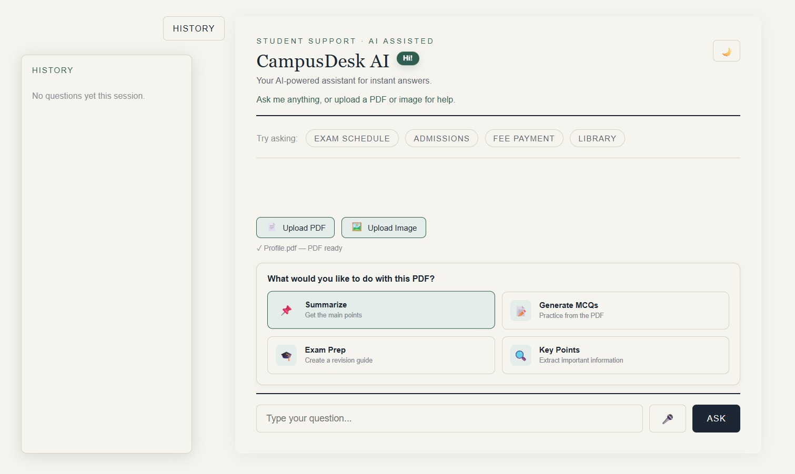
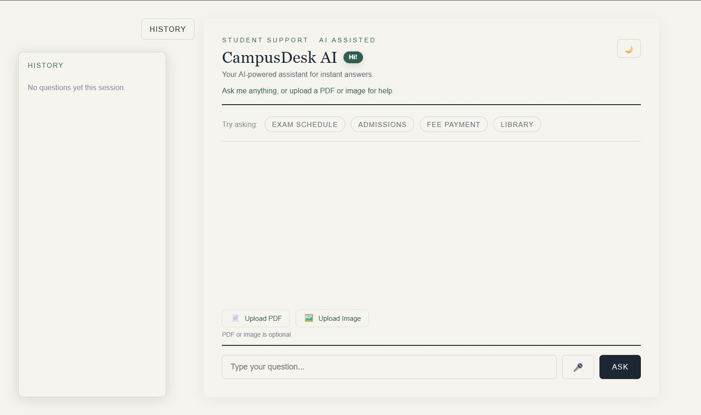
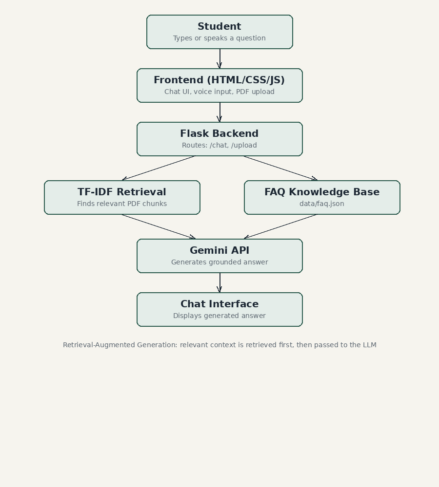

# CampusDesk AI

### AI-Powered Student Support Chatbot using Generative AI

CampusDesk AI is a Generative AI-powered student support chatbot designed to help students get quick and contextual answers to academic and college-related queries.

The chatbot uses Google's Gemini API to generate natural-language responses and combines a curated FAQ knowledge base with Retrieval-Augmented Generation (RAG) for answering questions from uploaded college documents.

It also supports multimodal interaction through image uploads, voice input, document-based study tools, conversation memory, and an installable Progressive Web App (PWA) experience.

---

##  PROJECT OVERVIEW 

Students often need information about admissions, examinations, fees, library services, academic documents, notices, and other college-related topics.

CampusDesk AI provides a single conversational interface where students can:

- Ask questions naturally instead of relying only on predefined FAQs
- Upload college PDFs such as syllabi, handbooks, and notices
- Ask questions based on uploaded documents
- Upload images for AI-powered analysis
- Generate summaries and study material from PDFs
- Use voice input and listen to AI-generated responses
- Continue conversations using contextual memory

The project was developed as part of an **IBM Generative AI course project**.

---

##  FEATURES

###  AI Chatbot

- Conversational student-support interface
- Natural-language question answering
- AI-generated responses powered by Google Gemini API
- Curated college FAQ knowledge base
- Suggested question chips for common queries
- Conversation memory within the current session
- Handles follow-up questions using recent conversation context
- Copy-to-clipboard functionality
- Voice input and AI voice responses

###  PDF Upload & Retrieval-Augmented Generation

- Upload college PDFs directly through the chatbot
- Supports documents such as syllabi, college notices, handbooks, and academic documents
- Extracts text from uploaded PDFs using `pypdf`
- Splits documents into overlapping chunks
- Uses TF-IDF vectorization for document representation
- Uses cosine similarity to retrieve relevant document sections
- Sends relevant retrieved content to Gemini for grounded responses

###  PDF Study Tools

Uploaded documents can be used for study-oriented tasks such as:

- Summarizing the document
- Generating MCQs
- Preparing for examinations
- Extracting important key points

###  Image Understanding

- Upload PNG, JPG/JPEG, or WEBP images
- Uses Gemini for AI-powered image analysis
- Allows students to ask questions about uploaded images
- Handles unclear or unreadable images without intentionally guessing

###  Voice Interaction

- Voice input using the Web Speech API
- Text-to-speech responses using the browser's Speech Synthesis API
- Users can listen to generated answers directly from the chat

###  User Experience

- Clean and responsive interface
- Light and dark themes
- Suggested question chips
- Session-based chat history
- Copy-to-clipboard functionality
- Typing/loading animation
- Responsive design for smaller screens

###  Progressive Web App

- Installable as an application on supported desktop and mobile browsers
- PWA manifest
- Service worker
- Offline shell caching

---

##  SCREENSHOTS

### CampusDesk AI Interface





### System Architecture


---

##  HOW IT WORKS

The overall workflow of CampusDesk AI is:

```text
                 ┌─────────────────────┐
                 │      Student        │
                 └──────────┬──────────┘
                            │
                            ▼
                 ┌─────────────────────┐
                 │  CampusDesk AI UI   │
                 └──────────┬──────────┘
                            │
                ┌───────────┼───────────┐
                │           │           │
                ▼           ▼           ▼
             Question      PDF         Image
                │         Upload        Upload
                │           │           │
                │           ▼           │
                │     Text Extraction   │
                │           │           │
                │           ▼           │
                │      Text Chunking    │
                │           │           │
                │           ▼           │
                │    TF-IDF Vectorizer  │
                │           │           │
                │           ▼           │
                │  Cosine Similarity    │
                │           │           │
                └───────────┼───────────┘
                            │
                            ▼
                   Relevant Context
                            │
                            ▼
                  ┌──────────────────┐
                  │   Gemini API     │
                  │  Generative AI   │
                  └────────┬─────────┘
                           │
                           ▼
                  Generated Response
                           │
                           ▼
                  ┌──────────────────┐
                  │     Student      │
                  └──────────────────┘
```

---

##  RAG PIPELINE

The document-based question-answering system follows these steps:

### 1. PDF Upload

The student uploads a PDF through the chatbot interface.

### 2. Text Extraction

Text is extracted from each PDF page using `pypdf`.

### 3. Document Chunking

The extracted text is divided into overlapping chunks of approximately 500 words.

The overlap helps preserve context between adjacent sections.

### 4. TF-IDF Vectorization

The document chunks and the user's question are converted into numerical TF-IDF vectors using `scikit-learn`.

### 5. Similarity Retrieval

Cosine similarity is calculated between the user's question and the document chunks.

The most relevant chunks are selected.

### 6. Context Construction

The retrieved document sections are combined with the college FAQ knowledge base and recent conversation history.

### 7. Generative AI Response

The resulting context is provided to Gemini, which generates a natural-language response.

This allows CampusDesk AI to combine **retrieval-based information access with Generative AI**.

---

##  PROJECT STRUCTURE 

```text
CampusDesk-AI/
│
├── app.py
│
├── data/
│   └── faq.json
│
├── static/
│   ├── style.css
│   ├── script.js
│   ├── manifest.json
│   ├── service-worker.js
│   └── icons/
│       ├── icon-192.png
│       └── icon-512.png
│
├── templates/
│   └── index.html
│
├── notebooks/
│   └── rag_logic_walkthrough.ipynb
│
├── docs/
│   └── architecture_diagram.png
│
├── tests/
│   └── test_core_logic.py
│
├── chatbot.png
├── .env.example
├── .gitignore
├── requirements.txt
└── README.md
```

---

##  TECH STACK 

| Category | Technology |
|---|---|
| Programming Language | Python |
| Backend Framework | Flask |
| Generative AI | Google Gemini API |
| AI Model | `gemini-3.5-flash` |
| Retrieval Technique | TF-IDF |
| Similarity Measure | Cosine Similarity |
| PDF Processing | pypdf |
| Machine Learning Library | scikit-learn |
| Frontend | HTML, CSS, JavaScript |
| Voice Input | Web Speech API |
| Voice Output | Speech Synthesis API |
| Data Storage | JSON |
| Application Type | Progressive Web App |

---

##  INSTALLATION & SETUP

### 1. Clone the repository

```bash
git clone https://github.com/stutirai/CampusDesk-AI.git
cd CampusDesk-AI
```

### 2. Install dependencies

```bash
pip install -r requirements.txt
```

### 3. Configure the Gemini API key

Create a `.env` file based on `.env.example`.

On Windows PowerShell:

```powershell
Copy-Item .env.example .env
```

Then open `.env` and add your API key:

```env
GEMINI_API_KEY=your-real-key-here
```

The `.env` file is excluded from version control through `.gitignore`.

**Never commit or publicly share your real API key.**

### 4. Run the application

```bash
python app.py
```

The application will start locally at:

```text
http://127.0.0.1:5000
```

Open the address in a browser.

---

##  TESTING

Basic project tests are included in:

```text
tests/test_core_logic.py
```

Run them using:

```bash
python tests/test_core_logic.py
```

---

##  RAG DEMONSTRATION NOTEBOOK

The repository includes:

```text
notebooks/rag_logic_walkthrough.ipynb
```

The notebook demonstrates the core retrieval process separately from the web application, including:

- Text chunking
- TF-IDF vectorization
- Cosine similarity
- Relevant chunk retrieval

Run:

```bash
jupyter notebook notebooks/rag_logic_walkthrough.ipynb
```

---

##  SECURITY

The Gemini API key is loaded through an environment variable:

```env
GEMINI_API_KEY=your-real-key-here
```

The real `.env` file is excluded from version control.

Only `.env.example` is included in the repository as a configuration template.

---

##  KNOWN LIMITATIONS 

### PDF Tables

Dense tabular PDF content, such as semester-wise credit tables, may not extract perfectly because PDF text extraction can flatten rows and columns.

Normal paragraphs and textual content generally work better with the current extraction approach.

A future improvement would be table-aware extraction using tools such as `pdfplumber`.

### In-Memory PDF Storage

Uploaded PDF content is stored in memory while the Flask application is running.

The uploaded document index is reset when the server restarts.

This approach is suitable for the current academic/demo scope.

### Session-Based Conversation Memory

Conversation history is maintained within the current browser session and is not stored in a permanent database.

---

##  FUTURE IMPROVEMENTS 

Possible future improvements include:

- Persistent document storage
- Multiple PDF/document management
- Source and page references for retrieved answers
- More advanced document parsing
- Table-aware PDF extraction
- Semantic embeddings instead of TF-IDF
- Vector database integration
- User authentication
- Persistent conversation history
- Public cloud deployment
- More advanced multimodal document understanding

---

##  PROJECT HIGHLIGHTS

CampusDesk AI demonstrates the integration of several Generative AI and AI-assisted application concepts:

- Generative AI
- Prompt-based question answering
- Retrieval-Augmented Generation (RAG)
- TF-IDF document retrieval
- Cosine similarity
- Multimodal AI interaction
- Conversational context
- Voice interaction
- Document-based AI assistance
- AI-powered study tools
- Progressive Web App development

The project focuses on solving a practical student-support problem while demonstrating how Generative AI can be combined with traditional information-retrieval techniques.

---

##  PROJECT LINKS

### GitHub Repository

https://github.com/stutirai/CampusDesk-AI

### Live Demo

The current version runs locally as a Flask application.

```bash
python app.py
```

Then open:

```text
http://127.0.0.1:5000
```

A public live deployment can be added in the future.

---

##  RESUME PROJECT TITLE

**CampusDesk AI — AI-Powered Student Support Chatbot**

### Resume Description

> Developed a Generative AI-powered student support chatbot using Flask and Google Gemini, featuring PDF-based Retrieval-Augmented Generation (RAG) using TF-IDF and cosine similarity, multimodal image analysis, voice interaction, conversational memory, and AI-powered document study tools.

---

##  AUTHOR

**Stuti Rai**

B.Tech — Artificial Intelligence & Data Science

---

##  LICENSE

This project was developed as an academic/educational project.
